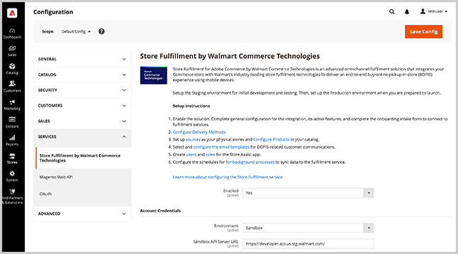
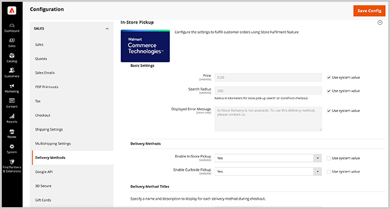

# 儲存服務和銷售配置

設定 [!DNL Store Fulfillment] 從 [!DNL Commerce] 管理員可啟用擴充功能、指定擴充功能設定、設定Store Assist應用程式使用者的安全設定，以及設定傳送方法的選項。

>[!IMPORTANT]
>
>商店履行服務設定僅在您連線Adobe Commerce執行個體及 [!DNL Store Fulfillment] 應用程式。 請參閱 [Connect Store Fullment](connect-set-up-service.md).

## 管理儲存完成服務設定

從 [!DNL Commerce Admin Store Configuration] 功能表。

- 啟用擴充功能、設定全域設定，以及透過選取「Store Assist應用程式」使用者連線和帳戶，指定安全選項 **[!UICONTROL Stores > Configuration > Services > Store Fulfillment by Walmart Commerce Technologies]**.

   

- 透過選取 **[!UICONTROL Store > Configuration > Sales > Delivery Methods > In-Store Pickup]**.

   

## 基本設定

<table>
<thead>
<tr>
<td><strong>欄位</strong></td>
<td><strong>說明</strong></td>
<td><strong>範圍</strong></td>
<td><strong>必填</strong></td>
</tr>
</thead>
<tbody>
<tr>
<td><strong>[!UICONTROL Price]</strong></td>
<td>在店裝貨向客戶收取的價格。 預設為零。</td>
<td>網站</td>
<td>否</td>
</tr>
<tr>
<td><strong>[!UICONTROL Search Radius]</strong></td>
<td>購物者在店面結帳中搜尋商店取貨位置時所使用的半徑（以公里為單位）。 搜索結果僅返回位於指定搜索半徑內的儲存。</td>
<td>網站</td>
<td>否</td>
</tr>
<tr>
<td><strong>[!UICONTROL Displayed error message]</strong></td>
<td>當客戶為無法用於店內提貨的物料選擇店內提貨時顯示的消息。 您可以視需要自訂預設文字。
</td>
<td>商店檢視</td>
<td>否</td>
</tr>
</tbody>
</table>

>[!NOTE]
>
>此 [!UICONTROL Search Radius] 只有在您已設定 [儲存位置和映射設定](store-location-map-provider-setup.md) Adobe Commerce。

## 啟用儲存完成解決方案

啟用 [!DNL Store Fulfillment] 解決方案，將店內和組織端取貨功能新增至Adobe Commerce店面中的購物和結帳體驗。

<table>
<thead>
<tr>
<td><strong>欄位</strong></td>
<td><strong>說明</strong></td>
<td><strong>範圍</strong></td>
<td><strong>必填</strong></td>
</tr>
 </thead>
 <tbody>
<tr>
<td><strong>[!UICONTROL Enabled]</strong></td>
<td>啟用或停用解決方案。 啟用後，請設定和使用「商店完成」功能，並建立Adobe Commerce商店與 [!DNL Store Fulfillment] 服務。 停用後，所有商店完成功能都會停用，而Adobe Commerce和商店完成服務之間沒有通訊。 無法處理或接收訂單資訊。</td>
<td>全球</td>
<td>是</td>
</tr>
</tbody>
</table>

## 添加帳戶憑據

<table>
<tr>
<td><strong>欄位</strong></td>
<td><strong>說明</strong></td>
<td><strong>範圍</strong></td>
<td><strong>必填</strong></td>
</tr>
<tr>
<td><strong>[!UICONTROL Environment]</strong></td>
<td>選取 <i>[!UICONTROL Sandbox]</i> 或 <i>[!UICONTROL Production]</i>  選取 [!UICONTROL Sandbox] 允許在測試環境中與履行服務進行通信。  選取 [!UICONTROL Production] 在即時環境中與履行服務進行通信。  您會獲得每個環境的一組憑證，並可在同一安裝中管理這兩組憑證。   在驗證連接之前保存憑據。</td>
<td>全球</td>
<td>是</td>
</tr>
<tr>
<td><strong>[!UICONTROL API Server URL]</strong></td>
<td>Walmart Store Fulfilment API端點的URL。 這必須是上線程式期間提供的完全合格URL。 儲存履行客戶會收到沙箱和生產URL。 新增值時，請務必複製並貼上完整URL，包括尾隨斜線「/」。</td>
<td>全球</td>
<td>是</td>
</tr>
<tr>
<td><strong>[!UICONTROL Token Auth Server URL]</strong></td>
<td>Walmart Store Fulfilment Authentication端點的URL。 值必須是上線程式期間提供的完全合格URL。 您會收到沙箱和生產URL。 新增值時，請務必複製並貼上完整URL，包括尾隨斜線「/」。</td>
<td>全球</td>
<td>是</td>
</tr>
<tr>
<td><strong>[!UICONTROL Merchant Id]</strong></td>
<td>您在上線過程中提供的唯一商家（租用戶）ID。 此ID可用來傳送訂單，以確保您的商家商店會收到訂單。</td>
<td>全球</td>
<td>是</td>
</tr>
<tr>
<td><strong>[!UICONTROL Consumer Id]</strong></td>
<td>上線程式期間提供的唯一整合ID。 此ID可用來驗證Adobe Commerce和商店履行服務之間的所有通訊</td>
<td>全球</td>
<td>是</td>
</tr>
<tr>
<td><strong>[!UICONTROL Consumer Secret]</strong></td>
<td>上線程式期間提供的唯一整合金鑰。 此金鑰可用來驗證Adobe Commerce和商店履行服務之間的所有通訊。</td>
<td>全球</td>
<td>是</td>
</tr>
</table>

設定 [!UICONTROL Account Credentials]，選取 <strong>[!UICONTROL Validate Credentials]</strong> 來驗證並建立與儲存履行服務的連接。

## 設定記錄

儲存履行服務的日誌可在日誌檔案中使用 `var/log/walmart-bopis.log`.

請系統管理員設定您的環境以允許例外處理，以便透過防火牆或快取擷取與API相關的例外。

因為應用程式日誌檔案可以快速增長，所以只在需要時(例如在排除 [!DNL Commerce] 順序。 此設定可防止生產環境中因大型記錄檔而發生的回應時間問題。

>[!TIP]
>
>對於Adobe Commerce內部部署安裝，請要求系統管理員為 `var/log/walmart-bopis.log` 檔案來將大小最小化。 若為Adobe Commerce內部部署安裝，請參閱 [日誌旋轉](https://experienceleague.adobe.com/docs/commerce-operations/installation-guide/next-steps/configuration.html#server-settings) 在 _Adobe Commerce安裝指南_. 如需雲端基礎架構專案的Adobe Commerce，請參閱 [檢視及管理記錄檔](https://experienceleague.adobe.com/docs/commerce-cloud-service/user-guide/develop/test/log-locations.html).

<table>
<thead>
<tr>
<td><strong>欄位</strong></td>
<td><strong>說明</strong></td>
<td><strong>範圍</strong></td>
<td><strong>必填</strong></td>
</tr>
</thead>
<tbody>
<tr>
<td><strong>[!UICONTROL Debug Mode]</strong></td>
<td>除錯模式可用來增加整合中的記錄活動。 停用時，不會記錄任何除錯資訊。 啟用後，會記錄所有除錯資訊   可在檔案中找到所有記錄的資料： <pre>var/log/walmart-bopis.log</pre>
<td>全球</td>
<td>否</td>
</tr>
</tbody>
</table>

## 管理訂單同步

配置設定以管理訂單同步的錯誤處理、用於訂單領料期間條碼掃描的目錄屬性，以及配置商店履行隊列的訂單批大小。

您可以從「管理員」的「儲存完成隊列管理」控制面板(
<strong>[!UICONTROL System > Tools > Store Fulfillment Queue]</strong>)。

### 同步錯誤管理

<table>
<tr>
<td><strong>欄位</strong></td>
<td><strong>說明</strong></td>
<td><strong>範圍</strong></td>
<td><strong>必填</strong></td>
</tr>
<tr>
<td><strong>[!UICONTROL Retry Critical Error]</strong></td>
<td>指定發生嚴重錯誤後，記錄同步操作的重試嘗試。  每當整合無法從履行服務獲得正面回應時，就會發生嚴重錯誤。 當服務關閉或傳送的訂單資料發生錯誤時，就會發生此情況。  達到重試閾值時，該項目將保留在隊列中，但不會再次處理。 查看所有包含錯誤的項 <strong>[!UICONTROL System > Tools > Store Fulfillment Queue]</strong> 在管理員中管理。 若要疑難排解持續出現的故障項目，請連絡您的客戶經理。</td>
<td>全球</td>
<td>否</td>
</tr>
<tr>
<td><strong>[!UICONTROL Enable Error Notification Email]</strong></td>
<td>啟用錯誤通知，以在 [!UICONTROL Retry Critical Error Threshold] 已到達訂購。 通知包含有關錯誤的任何可用詳細資訊。</td>
<td>全球</td>
<td>否</td>
</tr>
<tr>
<td><strong>[!UICONTROL Send Error Notification Email To]</strong></td>
<td>錯誤通知的收件者電子郵件地址清單（以逗號分隔）。</td>
<td>全球</td>
<td>否</td>
</tr>
<tr>
<td><strong>[!UICONTROL Order Sync Exception Email Template]</strong></td>
<td>指定用於通知收件者訂單同步錯誤的電子郵件模板。 提供預設範本。 不支援自訂。</td>
<td>商店檢視</td>
<td>否</td>
</tr>
</table>

### 訂單同步

<table>
<thead>
<tr>
<td><strong>欄位</strong></td>
<td><strong>說明</strong></td>
<td><strong>範圍</strong></td>
<td><strong>必填</strong></td>
</tr>
</thead>
<tbody>
<tr>
<td><strong>[!UICONTROL Barcode Source]</strong></td>
<td>目錄屬性，用於儲存商家位置中對應項目的可掃描代碼。  如果您只有一個現有的商家位置，則您可能會使用UPC代碼，而您的電子商務管道則會依SKU識別產品。 如果這是您的案例，請選取包含UPC代碼的目錄屬性。  此設定確保發送到您的商店的訂單清單項目具有正確的標識符，以便商店關聯人員能夠在挑庫過程中準確掃描物料。  如果您不確定，請與發運和領料部門的履行聯繫人進行檢查，以確定應發送的屬性。 如果資料庫中目前未包含該屬性，則您可能需要將適當的屬性新增至Adobe Commerce產品屬性集。</td>
<td>網站</td>
<td>是</td>
</tr>
<tr>
<td><strong>[!UICONTROL Barcode Type]</strong></td>
<td>目錄屬性，用於儲存商家位置中對應項目的條形碼源。  此設定確保發送到您的商店的訂單清單項目具有正確的標識符，以便商店關聯人員能夠在挑庫過程中準確掃描物料。 這些選項包括 — SKU、UPC、GTIN、UPCA、EAN13、UPCE0、DISA、UAB、CODABAR、嵌入式UPC價格。  如果您不確定，請選取最類似於 [!UICONTROL Barcode Source] 屬性。 儲存關聯仍然可以手動匹配其挑庫清單中的項目。</td>
<td>網站</td>
<td>是</td>
</tr>
<tr>
<td><strong>[!UICONTROL Max Number of Items]</strong></td>
<td>一次要從儲存履行隊列發送的最大項目數。  BOPIS訂單以定期間隔分批發送至履行服務。 此設定可讓您控制批次的大小。  預設值為100個項目。 根據您的訂購量和容量，您可能需要向上或向下調整此值。</td>
<td>全球</td>
<td>否</td>
</tr>
</tbody>
</table>

## 啟用「商店履行」發運選項

配置「商店完成運送」選項，以確定您的Adobe Commerce商店的店內取貨和家庭運送選項的可用性。

### 收貨方商店

<table>
<thead>
<tr>
<td><strong>欄位</strong></td>
<td><strong>說明</strong></td>
<td><strong>範圍</strong></td>
<td><strong>必填</strong></td>
</tr>
</thead>
<tbody>
<tr>
<td><strong>[!UICONTROL Enable Ship To Store]</strong></td>
<td>收貨方商店設定基於您現有的收貨方商店功能。 如果您使用Inventory management，或者如果您可以透過商店到商店的庫存轉移，在沒有庫存的商家地點接受並履行訂單，請將此選項設為「是」。  如果您不支援收貨方商店選項或不想提供它，請將設定為「否」。 停用時，目錄中商家商店的存貨為零的項目，或位於該位置以下的項目 [!DNL Out of Stock Threshold]，不提供店內取貨選項。  這是可根據商家位置調整的全域設定。</td>
<td>全球</td>
<td>否</td>
</tr>
</tbody>
</table>

### 發貨商店

<table>
<thead>
<tr>
<td><strong>欄位</strong></td>
<td><strong>說明</strong></td>
<td><strong>範圍</strong></td>
<td><strong>必填</strong></td>
</tr>
</thead>
<tbody>
<tr>
<td><strong>[!UICONTROL Enable Ship From Store]</strong></td>
<td>在您的商家商店中啟用或停用「首頁傳送」選項。 啟用後，會將您的商家商店位置與與您網站相關聯的庫存中其他指定來源進行匯總。  在標準Inventory management服務中， [!DNL Ship from Store] is選項是固有的，無法停用。 使用「商店完成」解決方案，您可以開啟或關閉它。  這是全域設定。 您也可以根據商家位置和產品來調整此設定。</td>
<td>全球</td>
<td>否</td>
</tr>
</tbody>
</table>

## 管理商店履行應用程式使用帳戶和權限

配置商店履行應用用戶帳戶和密碼安全以及雙因素身份驗證的設定。

### 應用程式安全性

<table>
<thead>
<tr>
<td><strong>欄位</strong></td>
<td><strong>說明</strong></td>
<td><strong>範圍</strong></td>
<td><strong>必填</strong></td>
</tr>
 </thead>
 <tbody>
<tr>
<td><strong>[!UICONTROL User Session Lifetime]</strong></td>
<td>在自動登出之前，與商店關聯的使用者工作階段維持作用中狀態的時間範圍（以秒為單位）。 有效值的範圍介於60到31536000之間。</td>
<td>全球</td>
<td>否</td>
</tr>
<tr>
<td><strong>[!UICONTROL Maximum Login Failures to Lockout Account]</strong></td>
<td>指定在將儲存關聯鎖定在其帳戶之外之前允許的失敗登錄嘗試次數。  要禁用帳戶鎖定，請將值設定為0。</td>
<td>全球</td>
<td>否</td>
</tr>
<tr>
<td><strong>[!UICONTROL Lockout Time (minutes)]</strong></td>
<td>登入失敗後要鎖定帳戶的分鐘數。</td>
<td>全球</td>
<td>否</td>
</tr>
<tr>
<td><strong>[!UICONTROL Force Password Change]</strong></td>
<td><em>[!UICONTROL Yes]</em>:在帳戶設定後要求使用者變更其密碼。  <em>[!UICONTROL No]</em>:建議用戶在帳戶設定後更改密碼。</td>
<td>全球</td>
<td>否</td>
</tr>
<tr>
<td><strong>[!UICONTROL Password Lifetime]</strong></td>
<td>在更改所需密碼之前，密碼保持有效的天數。 保留為空以停用此選項。</td>
<td>全球</td>
<td>否</td>
</tr>
</tbody>
</table>

### 雙因素驗證

<table>
<thead>
<tr>
<td><strong>欄位</strong></td>
<td><strong>說明</strong></td>
<td><strong>範圍</strong></td>
<td><strong>必填</strong></td>
</tr>
 </thead>
 <tbody>
<tr>
<td><strong>[!UICONTROL APP User 2FA]</strong></td>
<td>啟用或禁用儲存關聯的雙因素身份驗證。 當啟用時，提示儲存關聯提供由驗證提供者生成的一次性密碼。</td>
<td>全球</td>
<td>否</td>
</tr>
<tr>
<td><strong>[!UICONTROL APP 2FA Policy]</strong></td>
<td>設定雙因素驗證的實施策略。  <strong>[!UICONTROL Optional]</strong>:如果未設定提供程式，儲存關聯可以繞過雙因素驗證。  <strong>[!UICONTROL Mandatory]</strong>:需要儲存關聯才能完成雙因素驗證。</td>
<td>全球</td>
<td>否</td>
</tr>
<tr>
<td><strong>[!UICONTROL 2FA Providers]</strong></td>
<td>選擇一個或多個要提供儲存關聯的身份驗證提供程式服務。 若要設定雙因素驗證和驗證，商店關聯必須從安裝在其行動裝置上的可用提供者之一安裝驗證應用程式。</td>
<td>全球</td>
<td>否</td>
</tr>
</tbody>
</table>

## 傳送方法

透過擴充原生Adobe Commerce，儲存實作 [!DNL In-Store Delivery] 功能。 安裝擴充功能後，您可以使用新增至管理員的下列擴充設定，來設定商店內傳送方法。

- **店內提貨** — 結帳過程中店內交貨的選件選項這是BOPIS訂單最常見的交貨方案。

- **[!UICONTROL Curbside pick up]** — 客戶可選擇停放在商店位置，並由商店關聯商將訂單交付給他們。

從管理員選取 <strong>[!UICONTROL Stores > Configuration > Sales > Delivery Methods > In-Store Pickup]</strong>.

>[!NOTE]
>
>如需設定店內傳送選項的詳細資訊，請參閱 [店內傳遞](https://docs.magento.com/user-guide/shipping/shipping-in-store-delivery.html) 在 _Adobe Commerce使用手冊_.

### 傳送方法設定

使用店內交貨方法，客戶可以在結帳期間選擇要用作提貨地點的來源。

<table>
<thead>
<tr>
<td><strong>欄位</strong></td>
<td><strong>說明</strong></td>
<td><strong>範圍</strong></td>
<td><strong>必填</strong></td>
</tr>
 </thead>
 <tbody>
<tr>
<td><strong>[!UICONTROL Enable In-Store Pickup]</strong></td>
<td>對於選擇商店提貨的客戶，啟用或禁用在結帳期間可用的店內提貨選項。 當店內取貨被禁用時，不顯示選項。  此全域設定會套用至所有零售商店位置。 啟用後，您可以在零售商店位置選擇性地停用它。</td>
<td>網站</td>
<td>否</td>
</tr>
<tr>
<td><strong>[!UICONTROL Enable Curbside Pickup]</strong></td>
<td>對於選擇儲存裝貨的客戶，在結帳過程中啟用或停用「組織裝貨」選項。  此全域設定會套用至所有零售商店位置。 啟用後，您可以在零售商店位置選擇性地停用它。</td>
<td>網站</td>
<td>否</td>
</tr>
</tbody>
</table>

### 傳送方法標題設定

<table>
<thead>
<tr>
<th><strong>欄位</strong></th>
<th><strong>說明</strong></th>
<th><strong>範圍</strong></th>
<th><strong>必填</strong></th>
</tr>
</thead>
<tbody><tr>
<td><strong>首頁傳送標題</strong></td>
<td>指定在產品、購物車和結帳區域中，「首頁傳送」選項要顯示的標題。 首頁交貨是指Adobe Commerce的標準運送功能，從倉庫、承運人或直接到客戶提供的運送地址。   此標籤不會影響所選發運承運人的發運方法標籤。</td>
<td>商店檢視</td>
<td>否</td>
</tr>
<tr>
<td><strong>首頁傳送說明</strong></td>
<td>每次向客戶顯示首頁傳送標題時，都會顯示的選用說明。 通常，說明是傳達您傳送承諾的靜態訊息。 一些範例： <code>Same-day shipping on orders by 4</code>  <code>Ships within 2 business days</code></td>
<td>商店檢視</td>
<td>否</td>
</tr>
<tr>
<td><strong>商店取貨標題</strong></td>
<td>當向客戶顯示交付選項且可使用店內提貨時，會顯示此標籤。   您可以自訂此標籤，此標籤會顯示在產品、購物車和結帳區域中。</td>
<td>商店檢視</td>
<td>否</td>
</tr>
<td><strong>儲存裝貨說明</strong></td>
<td>無論顯示「商店提貨標題」的位置，您都可以選擇包含說明。 此靜態訊息有助於改善與商店取貨體驗相關的客戶通訊。 一些範例：  <code>Get it today for free!</code>  <code>Ready for pickup in an hour!</code></td>
<td>商店檢視</td>
<td>否</td>
</tr>
<tr>
<td><strong>店內取貨標題</strong></td>
<td>啟用「店內裝貨」後，此標題會以「商店裝貨」傳送選項的形式顯示給客戶。 您可以自訂其標籤。</td>
<td>商店檢視</td>
<td>否</td>
</tr>
<tr>
<tr>
<td><strong>組織端取貨標題</strong></td>
<td>啟用「組織裝貨」後，選項會以「商店裝貨」交貨選項的類型顯示給客戶。 您可以在此自訂其標籤。</td>
<td>商店檢視</td>
<td>否</td>
</tr>
<tr>
<td><strong>店內取貨指示</strong></td>
<td>當訂單準備好在您的零售商店取貨時，會以電子郵件通知客戶。 如果客戶已選取 [!DNL In-Store Pickup] 在結帳期間，您可以在此處自訂裝貨指示。   這是套用至所有零售商店位置的全域設定。 您也可以在零售商店位置層級自訂指示。</td>
<td>商店檢視</td>
<td>否</td>
</tr>
<tr>
<td><strong>組織端取貨指示</strong></td>
<td>指定要包括在客戶電子郵件通知中的定製訂單提貨指示，以便對客戶提貨訂單進行提貨。   這是套用至所有零售商店位置的全域設定。 您也可以在零售商店位置層級自訂指示。</td>
<td>商店檢視</td>
<td>否</td>
</tr>
<tr>
<td><strong>預計提貨提前期</strong></td>
<td>接收、履行和準備提貨前所需的分鐘數。 為「商店裝貨交貨」選項選擇零售商店位置時，會向客戶顯示此資訊。 此為全域設定，會套用至所有零售商店位置。 您也可以在零售商店位置層級自訂提前期。</td>
<td>商店檢視</td>
<td>否</td>
</tr>
<tr>
<td><strong>估計提貨時間標籤</strong></td>
<td>顯示訂單可用於客戶裝貨的預計時間。 當客戶為 [!DNL In-Store Pickup] 傳遞選項。   自訂此標籤時，您可以使用程式碼 <code>%1</code> 插入 <strong>預計提貨提前期</strong>. 例如：  <code>Ready for Pickup in %1 minutes.</code>  這是套用至所有零售商店位置的全域設定。 您也可以在零售商店位置層級自訂提前期。  <code>Ready for Pickup in %1 minutes.</code>  </td>
<td>商店檢視</td>
<td>否</td>
<tr>
<td><strong>裝貨時間免責聲明</strong></td>
<td>工具提示中產品頁面上顯示的內容，列出存放時數、節假日、意外關閉等</td>
<td>商店檢視
</td>
<td>否
</td>
</tr>
</tbody></table>

### 庫存可用性標題配置

<table>
<thead>
<tr>
<th><strong>欄位</strong></th>
<th><strong>說明</strong></th>
<th><strong>範圍</strong></th>
<th><strong>必填</strong></th>
</tr>
</thead>
<tbody><tr>
<td><strong>現車</strong></td>
<td>當客戶使用零售商店貨位時，將顯示每個地點當前物料的庫存可用性。   您可以自訂 <em>[!UICONTROL in-stock]</em> 狀態標籤。  </td>
<td>商店檢視</td>
<td>否</td>
</tr>
<tr>
<td><strong>無存貨</strong></td>
<td>當客戶使用零售商店貨位時，每個地點都會顯示任何當前物料的庫存可用性。</td>
<td>商店檢視</td>
<td>否</td>
</tr>
<tr>
<td><strong>部分有現車</strong></td>
<td>當客戶使用零售商店貨位時，每個地點都會顯示任何當前項目的庫存可用性。   您可以自訂 <em>[!UICONTROL partially in-stock]</em> 狀態標籤。  </td>
<td>商店檢視</td>
<td>否</td>
</tr>
</tbody></table>

