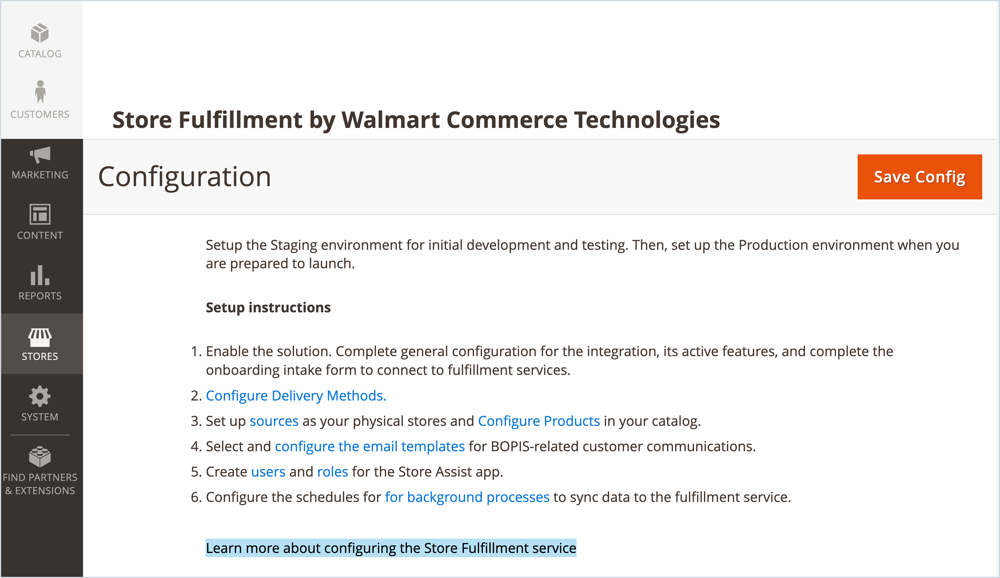

# 簡介 [!DNL Store Fulfillment]

Store Fullimment for Walmart Commerce Technologies為Adobe Commerce提供的Store Fullimment是一款與您的 [!DNL Commerce] 商店提供卓越的線上購買體驗，在商店購買(BOPIS)客戶體驗。

Store Fullment還提供端到端的履行工作流，該工作流可幫助商家降低成本，同時提高轉換率、平均訂單價值和客戶滿意度。 此工作流提供：

* **Omnichannel靈活性** — 將商店和倉庫變成提貨點和履行中心。

* **方便的客戶提貨選項** — 在選擇線上採購時，客戶可以輕鬆查看產品可用性，並為店內或路邊提貨選擇商店。

* **執行效率**- Store Assist移動應用程式幫助儲存關聯提高訂單履行速度和準確性。

* **移動便利** — 客戶在每個步驟都接收訂單通知。 從訂單確認到訂單提貨，他們可以跟蹤訂單狀態、獲取簽入說明，並在到達商店時與商店聯繫人通信。

* **操作可見性** — 改進儲存級庫存分配，以推動及時的本地完成。

## 儲存完成擴展

Store Fulfillment解決方案支援並增強了本機Adobe Commerce功能。

* 支援大多數產品類型 — 簡單、可配置、分組、捆綁和虛擬

* 與整合 [[!DNL Adobe Commerce] Inventory management](https://docs.magento.com/user-guide/catalog/inventory-learn-more.html)

* 與ERP、OMS和WMS等銷售點(POS)商戶庫存管理系統整合。

* 與Luma主題完全相容

* 為無頭店和維尼亞店面提供GraphQL支援

* 支援Walmart Commerce Technologies的Store Assist應用。 此應用將取貨訂單資訊直接傳送到所選商店位置的員工手持設備。 利用這些資訊，客戶在到達商店時可以快速而準確地挑選、存放和切換項目。

## 應用商店協助

用於iOS和Android™設備的Store Assist應用與 [!DNL Walmart Commerce Technologies] 為您的零售商店提供人才履行能力。

* 直接將店內和路邊的皮卡訂單發送到儲存關聯方的移動設備

* 確保商店訂單在到達商店時能夠快速、準確地被提取、存放和交給客戶以接收訂單

* 管理儲存關聯用戶訪問，包括安全策略、雙因素身份驗證等

* 自動將有關零售商店位置和庫存的資料同步到Adobe Commerce

## 增強的用戶體驗

商店履行通過添加功能來提供改進的購物體驗和簡化的履行工作流程來增強Adobe Commerce的能力。

* **儲存位置選擇器(SLS)** — 除本機簽出外，還將商店取貨選項、庫存可用性和商店選擇器添加到產品和購物車頁面。

* **庫存可用性** — 為Adobe CommerceInventory management添加其他產品和全球配置選項。 這些選項支援儲存級庫存分配，以推動及時的本地完成。

* **購物車和結帳功能增強** — 在客戶的線上購物會話中向客戶傳達最快的可用取貨時間、地點和成本。

* **簽入流程流** — 添加介面以改進客戶簽入流程，並在客戶到達商店或路邊提貨時與商店關聯方進行交互。

* **我的帳戶歷史記錄** — 擴展 [!DNL Commerce] 帳戶歷史記錄，顯示訂單歷史記錄中的步驟。

* **事務性電子郵件** — 擴展管理功能 [!UICONTROL Sales Emails] 要為線上購買添加電子郵件模板，請在商店交易記錄中提貨。 這些模板支援在訂單拾取過程中客戶和儲存關聯之間的即時通信。

* **靈活的履行** — 擴展 [!DNL Commerce] 支援方案以處理延交訂單、數量減少和部分訂單履行，同時方便支援這些方案所需的任何取消和貸項通知單。

>[!TIP]
>
> 如想快速演示「商店履行」解決方案，請參閱 [儲存完成概述](https://experienceleague.adobe.com/docs/commerce-learn/tutorials/orders/store-fulfillment.html) 可用 _Adobe Commerce視頻和Tutorials_。

